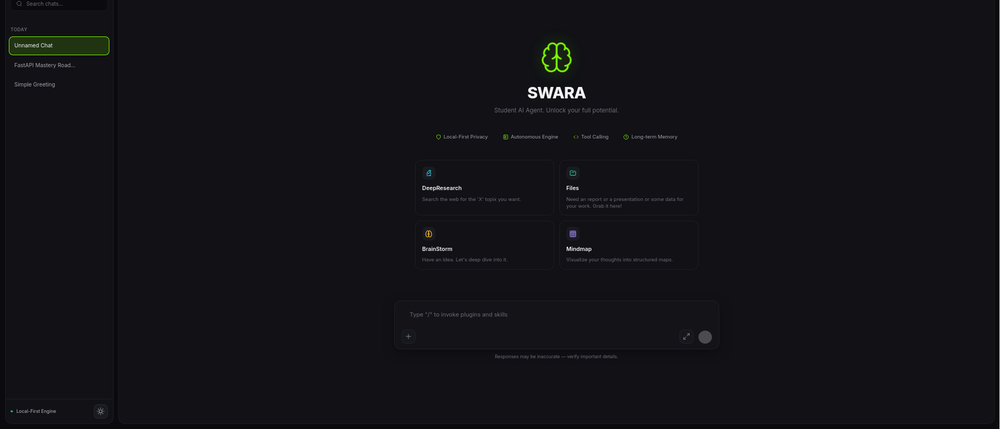
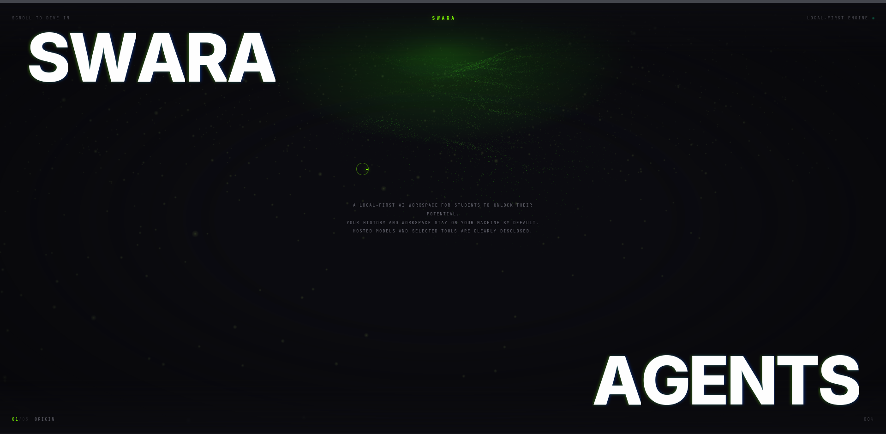
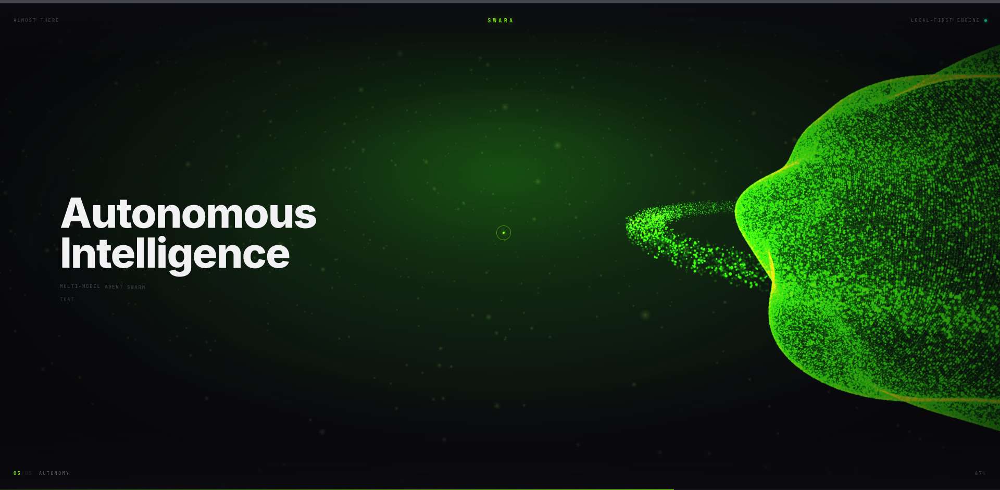
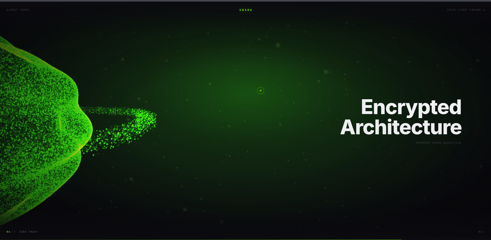
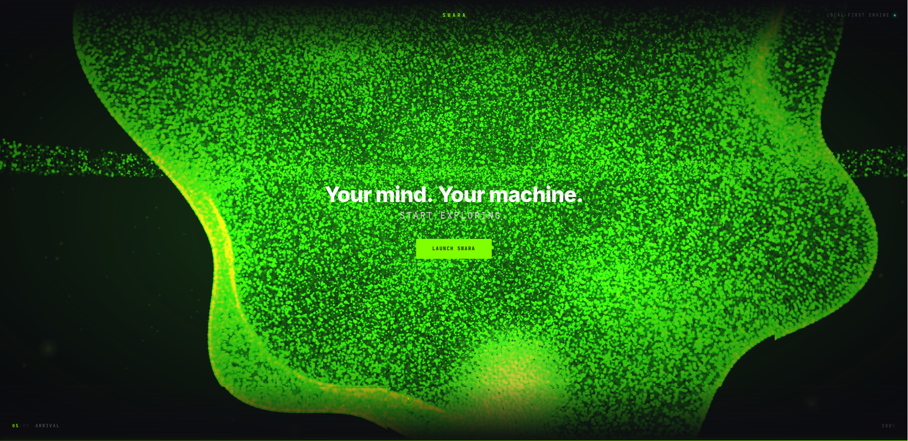
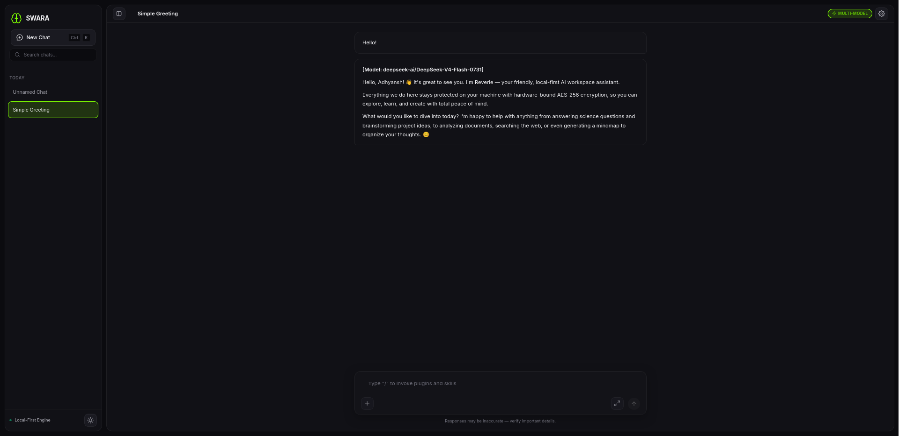
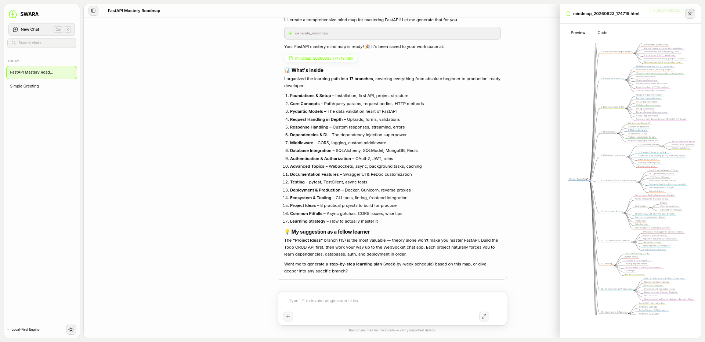
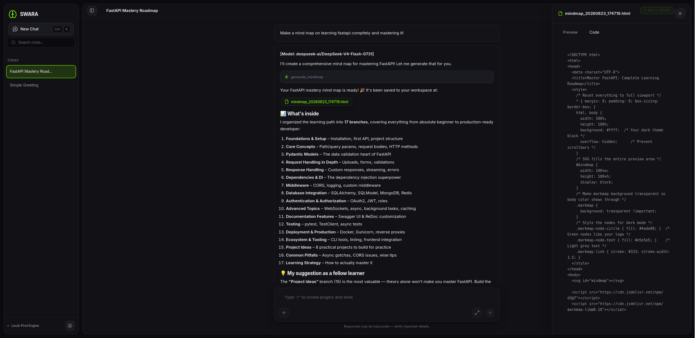

# Swara - Unlocking Student Potential










## Overview
Swara AI is an advanced, autonomous AI agent framework designed to bridge the gap between Large Language Models (LLMs) and local machine execution. Built with **FastAPI**, **LangGraph concepts**, and a highly modular tool ecosystem, Swara AI acts as a sophisticated digital assistant capable of reading files, writing code, executing scripts, solving math, creating interactive mindmaps, and managing its own memory securely.

Whether you prefer a lightweight **Terminal CLI** or a rich, interactive **Web UI**, Swara AI provides a seamless, cross-platform experience. It is fully packaged for standalone distribution using PyInstaller and automated via GitHub Actions.

## Key Features

### 🧠 Autonomous Agent Engine
- **Tool-Augmented Generation**: The core LLM is augmented with a suite of dynamic tools located in the `tools/` directory. It can autonomously decide when to use a tool, parse the output, and iteratively solve problems.
- **Dynamic Context Management**: Implements sophisticated token management to ensure the LLM doesn't hallucinate or exceed context windows when processing large codebases or datasets.

### 💻 Dual Interfaces
- **Web UI (`ui/main.py`)**: A modern, dark-themed FastAPI web interface. It features real-time token streaming, markdown rendering, syntax highlighting, and dynamic rendering of mindmaps/charts.
- **Terminal CLI (`chat_cli.py`)**: A fast, stream-capable command-line interface for developers who prefer living in the terminal.

### 🔒 Secure & Persistent Memory
- **SQLCipher Integration**: All chat histories and agent memories are stored locally in `reverie_chats.db` and encrypted using SQLCipher. Your data never leaves your machine unless explicitly sent to the LLM provider.
- **Vector Database**: Swara AI utilizes a custom vector storage engine (`memory/vector_db/`) for semantic search, allowing it to recall long-term context from past conversations and project files.

### 🛠️ Extensive Tool Ecosystem
- **PyX-Builder & Execution (`pyx_executor.py`)**: Safe execution of generated Python code in an isolated environment.
- **Browser Automation**: Integrates Playwright via a Model Context Protocol (MCP) server for deep web scraping and automated browser testing.
- **Interactive Visualizations**: Autonomously generates interactive HTML mindmaps and architectures (`interactive_gui_or_mindsmaps_and_charts/`).
- **Mathematical Solver**: A dedicated multi-step arithmetic solver for precise computational tasks.

### 🚀 CI/CD & Cross-Platform Builds
- **GitHub Actions**: Fully automated release pipelines for both Windows and Linux.
- **Standalone Executables**: Built with PyInstaller, meaning users do not need Python installed to run Swara AI. Just download the artifact and run.

---

## Repository Architecture

```text
.
├── agent_dir
│   ├── agent.py
│   ├── __init__.py
│   ├── model_router.py
│   ├── prompts
│   │   ├── chat_prompt.txt
│   │   ├── code_prompt.txt
│   │   ├── math_prompt.txt
│   │   ├── research_prompt.txt
│   │   └── system_prompt.txt
│   ├── skills
│   │   ├── browser_tools.md
│   │   ├── document_tools.md
│   │   ├── file_tools.md
│   │   ├── firecrawl_tools.md
│   │   ├── memory_tools.md
│   │   └── python_tools.md
│   ├── tools
│   │   ├── browser_tools.py
│   │   ├── document_tools.py
│   │   ├── file_tools.py
│   │   ├── firecrawl_tools.py
│   │   ├── memory_tools.py
│   │   ├── mindmap_tool_wrapper.py
│   │   ├── python_tools.py
│   │   └── skill_tools.py
│   └── tools_system.py
├── build.spec
├── chat_cli.py
├── dev_clean_memory.py
├── installations_instructions
│   └── pre_setup_fox_linux
├── main.py
├── path_manager.py
├── README.md
├── tools
│   ├── browser_auto
│   │   ├── a.sh
│   │   ├── browser_cli.py
│   │   ├── b.sh
│   │   ├── get_tools.py
│   │   ├── playwright-mcp-windows.zip
│   │   ├── report.md
│   │   └── win-dist
│   ├── chat_his
│   │   ├── ARCHITECTURE_REPORT.md
│   │   ├── deep_scan.py
│   │   ├── encrypted_chat_engine.py
│   │   ├── __init__.py
│   │   ├── process_kimi.py
│   │   ├── reverie_chats.db
│   │   ├── search_db2.py
│   │   └── search_db.py
│   ├── __init__.py
│   ├── interactive_gui_or_mindsmaps_and_charts
│   │   ├── generated_maps
│   │   ├── index.html
│   │   ├── markmap-autoloader.js
│   │   └── mindmap_tool.py
│   ├── memory
│   │   ├── __init__.py
│   │   ├── memory_engine.py
│   │   ├── report.md
│   │   └── vector_db
│   ├── memory_tool
│   │   └── memory_tool.py
│   ├── PyX-Builder
│   │   ├── Cargo.lock
│   │   ├── Cargo.toml
│   │   ├── python-embedded-linux.tar.gz
│   │   ├── python-embedded-windows.tar.gz
│   │   ├── pyx_linux
│   │   ├── pyx_windows.exe
│   │   ├── reproduction_report.md
│   │   ├── scripts
│   │   └── src
│   ├── pyx_executor.py
│   ├── solve maths arithmetic
│   │   ├── benchmark.py
│   │   ├── calculator.py
│   │   ├── step_calculator.py
│   │   ├── test_step_calc.py
│   │   └── tool.py
│   └── web_tools
│       ├── firecrawl_tools.py
│       └── report.md
├── ui
│   ├── index.html
│   ├── main.py
│   ├── report.md
│   └── static
│       ├── css
│       ├── img
│       ├── js
│       └── manifest.json
└── ui_story
    ├── index.html
    └── static
        ├── app.js
        └── style.css

27 directories, 74 files
```

## Installation & Setup (For Developers)

### Prerequisites
- Python 3.10+
- `git`

### 1. Clone the Repository
```bash
git clone https://github.com/AVadhyanshverma/swara-ai.git
cd swara-ai
```

### 2. Set Up Virtual Environment
```bash
python -m venv .venv
# On Windows
.venv\Scripts\activate
# On Linux/Mac
source .venv/bin/activate
```

### 3. Install Dependencies
```bash
pip install -r requirements.txt
# Ensure you have uvicorn, fastapi, langchain, pyinstaller, etc.
```

### 4. Run the Application
**For the Web UI:**
```bash
python ui/main.py
# The server will start at http://localhost:8000
```
**For the Terminal CLI:**
```bash
python chat_cli.py
```

## Contribution Guidelines
1. Fork the repository.
2. Create a feature branch (`git checkout -b feature/AmazingFeature`).
3. Commit your changes (`git commit -m 'Add some AmazingFeature'`).
4. Push to the branch (`git push origin feature/AmazingFeature`).
5. Open a Pull Request.

## License
Distributed under the MIT License. See `LICENSE` for more information.
